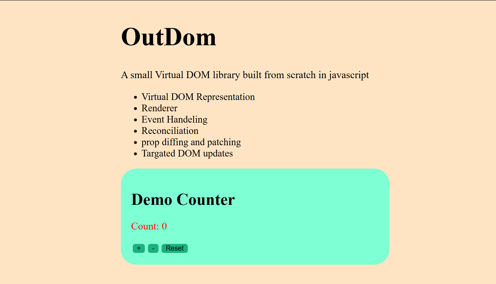

<h1 align="center">OutDOM</h1>

A lightweight Virtual DOM library built from scratch in vanilla JavaScript to explore how modern UI frameworks perform rendering, reconciliation, and targeted DOM updates.



## Overview

OutDOM is a learning-focused implementation of a Virtual DOM system. It demonstrates how UI libraries can represent interfaces as JavaScript objects, compare changes efficiently, and update only the necessary parts of the DOM.

### Features

* Virtual DOM representation
* Element creation helper (`h`)
* Recursive renderer
* Event handling system
* Reconciliation (diffing)
* Prop diffing and patching
* Targeted DOM updates
* Interactive counter demo

---

## Project Structure

```text
src/
├── app.js           # Demo application
├── h.js             # Virtual DOM element creation helper
├── main.js          # Application bootstrap and updates
├── reconciler.js    # Diffing and reconciliation logic
└── renderer.js      # Virtual DOM → Real DOM renderer

public/
└── image.png        # Project screenshot

index.html
index.css
README.md
```

---

## How It Works

### 1. Virtual DOM Creation

UI elements are represented as plain JavaScript objects.

```javascript
{
  type: "button",
  props: {
    onClick: handleClick
  },
  children: ["Click Me"]
}
```

### 2. Rendering

The renderer recursively converts Virtual DOM nodes into real DOM elements.

```text
Virtual DOM
     ↓
 Renderer
     ↓
 Real DOM
```

### 3. State Updates

Whenever application state changes, a new Virtual DOM tree is generated.

### 4. Reconciliation

The new tree is compared against the previous tree to detect differences.

### 5. DOM Patching

Only the affected DOM nodes are updated, avoiding unnecessary DOM operations.

```text
Old Tree
    ↓
Compare
    ↓
New Tree
    ↓
Patch DOM
```

---

## Demo

The included counter application demonstrates:

* Increment
* Decrement
* Reset
* Event handling
* Reconciliation
* Targeted DOM updates

Each interaction generates a new Virtual DOM tree and triggers reconciliation against the previous tree.

---

## Example

```javascript
const vnode = h(
  "button",
  {
    onClick: () => console.log("Clicked!")
  },
  "Click Me"
);
```

The Virtual DOM node is rendered into the DOM and later reconciled against future updates.

---

## Running Locally

Clone the repository:

```bash
git clone https://github.com/itisrudraa/OutDOM
```

Navigate into the project:

```bash
cd outdom
```

Start a local server:

```bash
npx live-server
```

Or use the VS Code Live Server extension.

---

## Learning Goals

This project was built to better understand:

* Virtual DOM architecture
* Recursive rendering
* DOM diffing strategies
* Reconciliation algorithms
* Event binding
* Efficient UI updates

OutDOM is intended as an educational project rather than a production-ready framework.

---

## Current Status

### Implemented

* Virtual DOM representation
* Recursive renderer
* Event listeners
* Reconciliation
* Text node updates
* Prop updates and removal
* Event listener updates
* Node creation and replacement

### Planned

* Fragment support
* Keyed reconciliation
* Component abstraction
* Hooks / state system
* JSX transform support
* Improved diffing optimizations

---

## Motivation

The goal of OutDOM is not to compete with established frameworks, but to understand the ideas behind them by building the core pieces from scratch.

By implementing rendering, diffing, and reconciliation manually, the project provides a practical look into how libraries such as React update user interfaces efficiently.

---

## License

MIT
